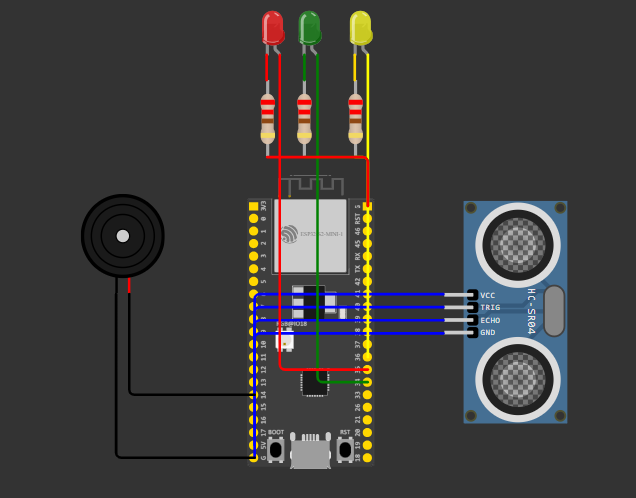

# 🤖 Estação de Bem-Estar para Home Office

## 🎯 Tema: O Futuro do Trabalho (Saúde e Bem-Estar)
## ❓ Problema Abordado

O trabalho remoto e híbrido, embora flexível, frequentemente leva a maus hábitos ergonômicos e longos períodos sem pausa, resultando em fadiga física e mental. Sem a supervisão de um escritório tradicional, o bem-estar e a produtividade do trabalhador remoto são comprometidos.

## ✅ Solução Proposta

Desenvolvi uma Estação de Bem-Estar Inteligente baseada em IoT que monitora a postura do usuário em tempo real e incentiva pausas ativas.  
A solução utiliza um sensor ultrassônico para medir a distância do usuário em relação à tela (ergonomia) e um timer inteligente que só dispara o alerta de pausa após um período de trabalho focado (Postura Correta contínua). Todos os alertas de status são enviados via HTTP para uma aplicação externa.

# ⚙️ Componentes e Dependências Técnicas

## 🛠️ Hardware Simulado (Wokwi)

| Componente                      | Função no Projeto                |
| ------------------------------  | -------------------------------- |
| **ESP32 DevKit**                | Controlador principal com Wi-Fi. |
| **Sensor Ultrassônico HC-SR04** | Mede a distância (postura)       |
| **LED Vermelho**                | Alerta: Hora da Pausa.           |
| **LED Amarelo**                 | Alerta: Postura Incorreta.       |
| **LED Verde**                   | Status: Postura Correta.         |
| **Buzzer**                      | Feedback sonoro para Pausa.      |

## 🧩 Dependências do Código

O projeto requer as seguintes bibliotecas padrão do Arduino IDE (já inclusas no ambiente Wokwi):

1. WiFi.h - Para conexão à rede.
2. HTTPClient.h - Para realizar requisições POST para o servidor IoT.

## 💻 Instruções de Uso e Demonstração

Este projeto é projetado para ser testado no simulador Wokwi.

  
🔗 [Wokwi](https://wokwi.com/projects/447930763074494465)   
📽️ [Video Demonstrativo](https://youtu.be/xTeYCr2AWuM)

1. Inicialização
Clique em "Start Simulation".
Verifique o Monitor Serial (janela inferior) para confirmar a conexão Wi-Fi e o endereço IP.

2. Lógica de Postura (Controle Principal)
O sistema verifica a distância do sensor (simulando a distância do seu rosto para a tela) e reage:

| Ação no Sensor (Slider)         | Distância (cm)                   | Status no Serial Monitor   | LED Acionado   |
| ------------------------------  | -------------------------------- | -------------------------- | -------------- |
| **Ausente (Sem Usuário)**       | > 70 cm                          | Status: Ausente            | Todos Apagados |
| **Postura Incorreta**           | < 20 cm                          | Status: Postura Incorreta! | Amarelo ⚠️     |
| **Postura Correta**             | 20 cm a 70 cm                    | Status: Postura Correta    | Verde ✅       |

3. Comunicação IoT (HTTP POST)

Sempre que o status muda para "Postura Correta" ou "Postura Incorreta", o sistema envia dados.  
Teste: Verifique o Monitor Serial logo após mover o slider para um novo estado.  
Resultado Esperado:  
Enviando HTTP POST para: http://httpbin.org/post  
HTTP OK (200) — Confirma o envio de dados.

4. Pausa Inteligente (Timer)

O timer só é ativado quando a Postura Correta é detectada, incentivando pausas após o trabalho focado.

| Ação                        | Lógica no Código                                                        | Feedback                                      |
| --------------------------- | ----------------------------------------------------------------------- | --------------------------------------------- | 
| **Início da Contagem**      | O flag isWorking é ativado e a variável workSessionStartTime é gravada. | Iniciando contagem de tempo de trabalho...    |
| **Alerta de Pausa**         | A função checkBreakTime() verifica se (currentTime - workSessionStartTime) é maior que Descanso | LED Vermelho acende, Buzzer toca e Status: Hora da Pausa! |
| **Reinício do Ciclo**      | Mover o slider para > DistanciaCorreta. A variável onBreak é desativada. | Usuário saiu para a pausa. Reiniciando ciclo. |

# 📈 Impacto e Relevância

Este projeto demonstra como a tecnologia pode transformar o bem-estar no trabalho:   
Benefício: Reduz o risco de lesões e fadiga 3 ao fornecer feedback ativo de ergonomia.  
Aplicação Real: O sistema pode ser expandido para integrar-se a aplicativos de produtividade (como o Google Calendar para agendar a próxima pausa) ou para otimizar o consumo energético em espaços de trabalho.

## 👥 Autor

| Nome                           | RM       |
| ------------------------------ | -------- |
| **Gustavo Moretim Canzi**      | RM567683 |